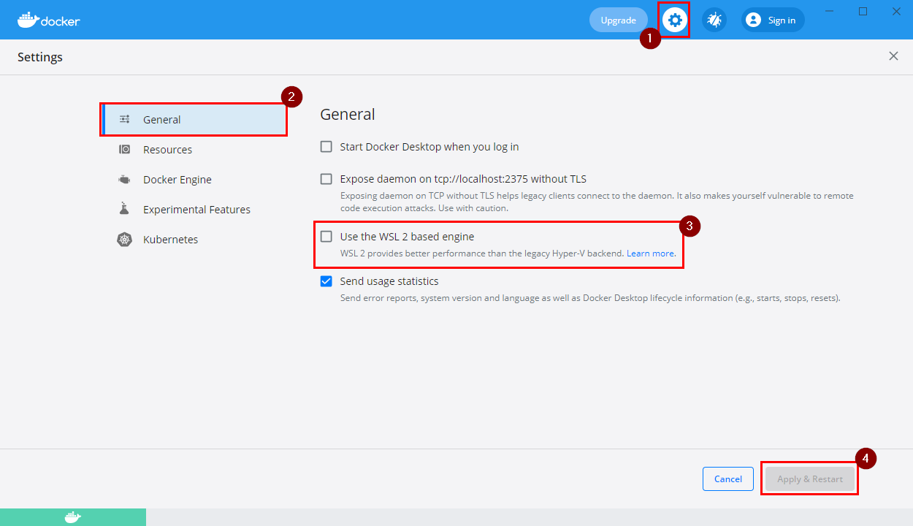

# Docker Development Setup

# Configure and run the dockerized application:

### 1. Create `.env` file
- copy `.env.sample` to `.env`


### 2. Set your project name
Set your project name in the `.env` file like so:
```dotenv
COMPOSE_PROJECT_NAME=my-project
```
This prevents container name collisions in the future.


### 3. Database
#### Config:
Set the password for all your databases in the `.env` file:
```dotenv
MYSQL_ROOT_PASSWORD=password
```
#### Import at initial startup:
To import a database at **initial** docker startup move a `.sql` file to `./_docker/mariadb/sql`

At initial startup it will create a new database for each `.sql` file in this directory named after that file and import the `.sql` file.

If the container is already running, stop it, tear it down and start it again to trigger the import:
```shell
docker-compose down
docker-compose up
```

### 4. Webserver Setup
If you need to set the root directory of your web application other than `./` (for example `/webroot`) set it in `_docker/apache-php/sites-available/000-default.conf`:
```apacheconf
# ...
DocumentRoot /var/www/html/webroot
```
After that you need to restart the container.

### 5. Download and configure Docker Desktop
If you are on Windows or Mac download and install [Docker Desktop](https://www.docker.com/get-started) if you haven't already.

If you are on Winodws make sure to **disable the WSL 2 based engine** and use the Hyper-V backend instead as this can lead to performance issues with docker volumes (10x faster).

This can be done in the Docker Desktop Dashboard:


### 6. Start your containers
After configuration you can start your containers with:
```shell
docker-compose up
```
Make sure to start the docker daemon first ([Docker Desktop](https://www.docker.com/get-started)).

The first time executing this takes a few minutes.

> **Tip**: The Dashboard of Docker Desktop can be quite useful to manage your containers.


### 6. Connect to database
#### Application config
To connect your **application** to the database use the following parameters:
- host: name of MariaDB docker container `mariadb-<COMPOSE_PROJECT_NAME>`
    - `COMPOSE_PROJECT_NAME` is defined in `.env` file
- database: specified with the filename of the imported `.sql` file
- user: `root`
- password: specified with `MYSQL_ROOT_PASSWORD` in `.env` file
  
#### Connect from client
You can connect to the database from any client outside of docker (for example [DBeaver](https://dbeaver.io/)) on:
- host: `localhost`
- port: can be configured in `.env` file (default `3307`).  Make sure to restart the containers after changing it.
```dotenv
MARIADB_PORT=3307
```


### 7. Composer install
Install your PHP dependencies with `composer install` **inside** the docker container:
```bash
docker exec -it php-apache-<COMPOSE_PROJECT_NAME> /bin/bash
composer install
```
`COMPOSE_PROJECT_NAME` is defined in `.env` file


### 8. Open Application
To open the application frontend open `localhost:<port>` in your browser.

You can configure the port in `.env` file (default `8080`). Make sure to restart the containers after changing it.
```dotenv
APACHE_PORT=8080
```


### 8. xdebug
xdebug is **installed and enabled by default**.

To disable xdebug with PHP version `< 7.2` change the file `./_docker/apache-php/additional-inis/xdebug.ini` to:
```ini
xdebug.remote_enable=0
```
To disable xdebug with PHP version `>= 7.2` change the file `./_docker/apache-php/additional-inis/xdebug.ini` to:
```ini
xdebug.mode=off
```
To enable xdebug with PHP version `>= 7.2` change the file `./_docker/apache-php/additional-inis/xdebug.ini` to:
```ini
xdebug.mode=debug
```
After that you need to restart the container.


### 9. Configure WKHTMLTOPDF:
If installed the wkhtmltopdf binary will be available in the container under `/usr/local/bin/wkhtmltopdf`, so set this path in your application settings.


# Dockerize the application:


### Note 1:
If you make any changes to one of the following files:
- any `Dockerfile`

make sure to rebuild it:
```shell
docker-compose build
```
After that you can start it again with:
```shell
docker-compose up
```

## Configuration:

### 1. PHP setup
To specify the **PHP version** change the `FROM` command in `./_docker/apache-php/Dockerfile`

e.g. for PHP version 5.6:
```dockerfile
FROM php:5.6-apache
```
After that make sure to build this container again (see Note 1 above)

#### PHP Extensions:
To install and enable **PHP extensions** add them to `./_docker/apache-php/Dockerfile`.
```dockerfile
RUN install-php-extensions <extensionname>
```
If this did not work try this:
```dockerfile
RUN docker-php-ext-install <extensionname>
```
All available extensions see here: https://github.com/mlocati/docker-php-extension-installer#supported-php-extensions

More information on https://hub.docker.com/_/php/ at *How to install more PHP extensions*

#### Config:
To edit any `php.ini` config, just add another `.ini` file to `_docker/apache-php/additional-inis/`


### 2. Database configuration
If you need to configure some database parameters (for example `innodb_file_format`), you can do that in the `_docker/mariadb/my.cnf` file.


### 3. Install Composer
To install Composer with container build change the `docker-compose.yml` to:
```yaml
services:
  apache-php:
    build:
      # ...
      args:
        INSTALL_COMPOSER: "true"
```
After that you have to rebuild the container (see Note 1)


### 4. install wkhtmltopdf
If you want to install [wkhtmltopdf](https://wkhtmltopdf.org) as a depencency change the `docker-compose.yml` to:
```yaml
services:
  apache-php:
    build:
      # ...
      args:
        INSTALL_WKHTMLTOPDF: "false"
```
After that you have to rebuild the container (see Note 1)

Then the binary from wkhtmltopdf is available in the container under `/usr/local/bin/wkhtmltopdf`, so set this path in your application settings


## Troubleshoot
#### bash into container:
To troubleshoot anything inside a container, go into the container with:
```shell
docker exec -it <container-name> /bin/bash
```
If this doesn't work try this:
```shell
docker exec -it <container-name> /bin/sh
```


# Roadmap
* [x] initial composer install execution within docker container
* [x] use of docker alpine packages to create smaller container
* [x] set webroot of web application
* [x] move wkhtmltopdf and composer to another dependency, and not .env bc it is git dependent
* [x] Split Documentation in "Dockerize your application", "Run your application in Docker"
* [x] support for multiple sql files imported into seperate databases
* [x] add my.cnf for easier configuration
* [x] performance improvements (switch to hyper-v)
* [x] echo of localhost:<port> after starting container
* [ ] setup for https connections (sgv project?)