# Docker Development Setup

# Intro: What is this Docker setup?

This Docker development setup is mainly setup with the `docker-compose.yml` file. 
It creates two containers at startup (`web` and `db`).

The `web` container runs Debian (Linux) and is responsible for the web application.
The current directory will be available in the `/var/www/html` directory of the web application.


The `db` container runs Alpine Linux (very small Linux).
It holds the database server and is therefore responsible for managing database connection etc. 


# Configure and run the dockerized application:

### 1. Create `.env` file
copy `.env.sample` to `.env`

### 2. Set some important variables
Set your project name in the `.env` file like so:
```dotenv
PROJECT_NAME=my-project
```
This prevents container name collisions in the future.
___

Before we can configure a custom domain where your application will be available at, 
we need to set an **unused loopback IP** from the IP range `127.0.0.0/8` in your `.env` file. 

For example:
```dotenv
LOOPBACK_IP=127.0.0.2
```
**Note**: If your configured `LOOPBACK_IP` is already in use, it will tell you the next free IP at container startup.
___
Set a custom domain where your application will be available at:
```dotenv
DOMAIN=test.local
```
___
Set the absolute path to your `hosts` file on your OS:
```dotenv
HOSTS_FILE=/c/Windows/System32/drivers/etc/hosts    # use this for Windows
#HOSTS_FILE=/etc/hosts                              # use this for Linux
#HOSTS_FILE=/private/etc/hosts                      # use this for MacOS
```
This is needed to automatically set your domain in your hosts file.

>**Important**: Make sure your `hosts` file is writable. On Windows this is done like this:
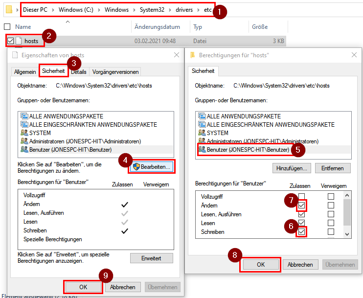

### 3. Database
#### Import at initial startup:
To import a database at **initial** docker startup move a `.sql` file to `./_docker/db/sql`

After that map this file to a database name of your choice in your `.env` file:
```dotenv
DATABASE_NAME_MAIN=test_name
DATABASE_FILE_MAIN=test.sql
```
This will import the file `./_docker/db/sql/test.sql` in the newly created database `test_name` at container startup within the `db` container.

To import **multiple** databases, add another `.sql` file and add more mapping variables with another suffix than `_MAIN` like above.

**Important**: If the container is already running, stop it, tear it down and start it again to trigger the import:
```shell
docker-compose down   # Warning: this will delete your database inside the container
docker-compose up
```

### 4. Download and configure Docker Desktop
If you are on Windows or Mac download and install [Docker Desktop](https://www.docker.com/get-started) if you haven't already.

If you are on Winodws make sure to **disable the WSL 2 based engine** and use the Hyper-V backend instead as this can lead to performance issues with docker volumes (10x faster).

This can be done in the Docker Desktop Dashboard:
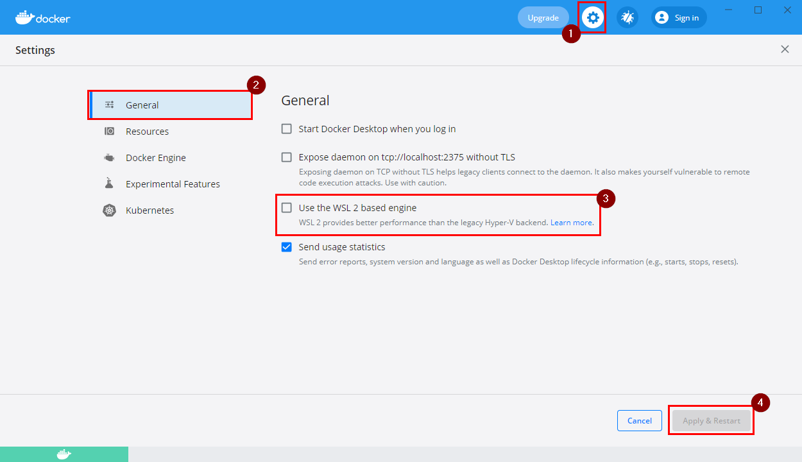

### 5. Start your containers
After configuration you can start your containers with executing the following command **in the root directory of your project**:
```shell
docker-compose up
```
Make sure to start the docker daemon first ([Docker Desktop](https://www.docker.com/get-started)).

The first time executing this takes a few minutes.

> **Tip**: The Dashboard of Docker Desktop can be quite useful to manage your containers.

#### Port error
If you get an error like:
```
Ports are not available: listen tcp 127.55.0.1:3308: bind: Der Zugriff auf einen Socket war aufgrund der Zugrifssrechte des Sockets unzulässig.
```
You have to change the corresponding port in you `.env` file to a port that is available on your local system. **For example**:
```dotenv
WEB_PORT: 8081
WEB_PORT_SSL: 4443
DB_PORT: 3309
```

### 6. Connect to database (client)
You can connect to the database (for example [DBeaver](https://dbeaver.io/)) with the following credentials:
- host: the `DOMAIN` variable you specified in your `.env` file
- port: the `DB_PORT` variable you specified in your `.env` file
- user: `root`
- password: `root` (if not specified differently in `docker-compose.yml` with the environment variable `MYSQL_ROOT_PASSWORD` of the `db` container)
- database name: the `DATABASE_FILE_MAIN` or `DATABASE_FILE_<OTHER_SUFFIX>` you specified in your `.env` file


### 7. Open Application
#### Local
To open the application frontend open `http://<DOMAIN>:<WEB_PORT>` in your browser.

You can configure your `DOMAIN` in `.env` file. Make sure to restart the containers after changing it:
```dotenv
DOMAIN=test.local
```
#### https
If you need the application available through https, you need to set `HTTPS=true` in your `.env` file and
create a certificate with the `install-cert.cmd <DOMAIN>` script. This script works on Windows, macOS and Linux.

After that, you need to restart your containers and then you can access your application at `https://<DOMAIN>:<WEB_PORT_SSL>`.

If you need to access it on Firefox, you first need to import the RootCA certificate in the certificate settings of Firefox (see screenshot). 
The `install-cert.cmd` tells you the location of this certificate file called `rootCA.pem`.

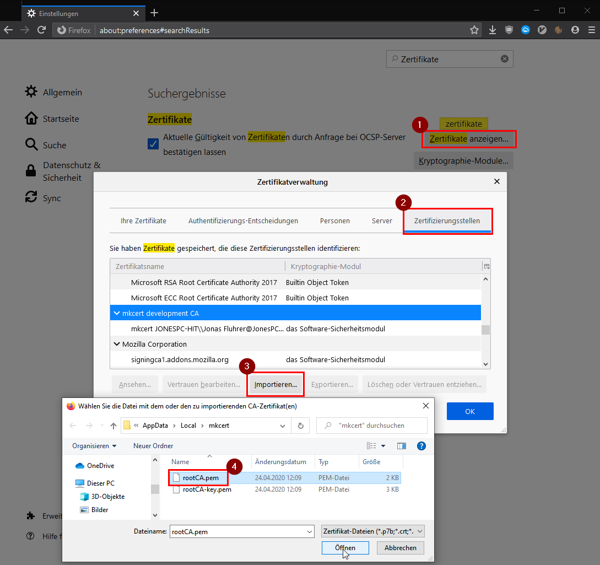

#### On the network
If you want to access your application from **another device on the same network**, set `EXTERNAL_IP` in your `.env` 
file to the IP your computer has on the corresponding network interface. **For example**:
```dotenv
EXTERNAL_IP=192.168.178.54
```
After you restarted your container, the application will be available at `http://192.168.178.54:<WEB_PORT>` on the network you are connected to.

### 8. Xdebug Configuration
Xdebug is **installed and enabled by default** and is ready to use.

To disable xdebug with PHP version `< 7.2` change the file `./_docker/web/additional-inis/xdebug.ini` to:
```ini
xdebug.remote_enable=0
```
To disable xdebug with PHP version `>= 7.2` change the file `./_docker/web/additional-inis/xdebug.ini` to:
```ini
xdebug.mode=off
```
To enable xdebug with PHP version `>= 7.2` change the file `./_docker/web/additional-inis/xdebug.ini` to:
```ini
xdebug.mode=debug
```
After that you need to restart the container.

In this file you can also specify any other xdebug config you might need.

### 9. Xdebug usage:
#### usage in browser
To use xdebug with PHPStorm do the following:
1. Set a breakpoint in your code:
   
   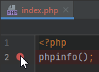
2. Listen to xdebug connections in your IDE: 
   
   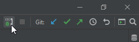
3. Turn on your browser debug extension and reload page: 
   
   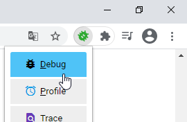
4. **Choose correct project** and accept incoming connection: 
   
   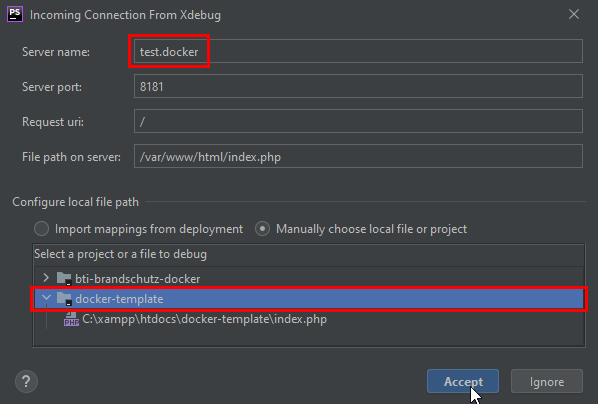
5. Set path mappings in IDE settings: root of project should be set to `/var/www/html` 
   
   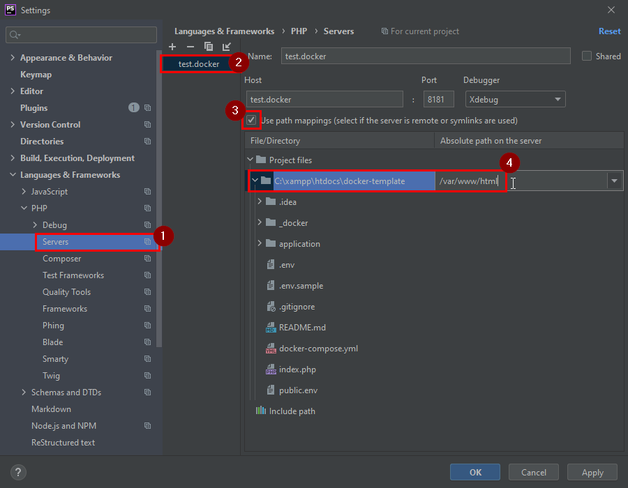
6. Reload page

If you fucked up somewhere in between, delete the server configuration in `Settings > Languages & Frameworks > PHP > Servers` and start over.

#### Debug a PHP script:
The following picture describes how to setup a Debug Configuration in PHPStorm in `Run - Edit Configurations`: 
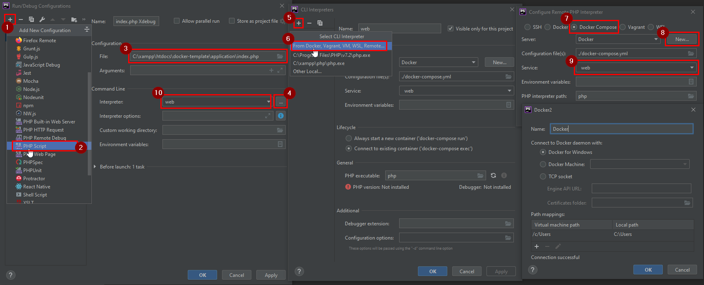

1. Click on the `+`  to create a new configuration
2. Choose `PHP Script`
3. Choose your local file you want to debug
4. Click on `...` next to the CLI interpreter
5. Click on the `+` to create a new PHP CLI Interpreter
6. Choose `From Docker, Vagrant, VM, WSL, Remote...`
7. Choose `Docker Compose`
8. Click on `New...` next to *Server* if you haven't created a Docker Server Configuration yet. Confirm with `OK`.
10. Make sure to set the Interpreter to the created `web` CLI Interpreter.

After that make sure you **also** have the PHP CLI Interpreter configured to the docker container at `Settings - Languages & Frameworks - PHP`.
Here you also have to configure the path mapping of your project root to the root inside the container (`/var/www/html`):
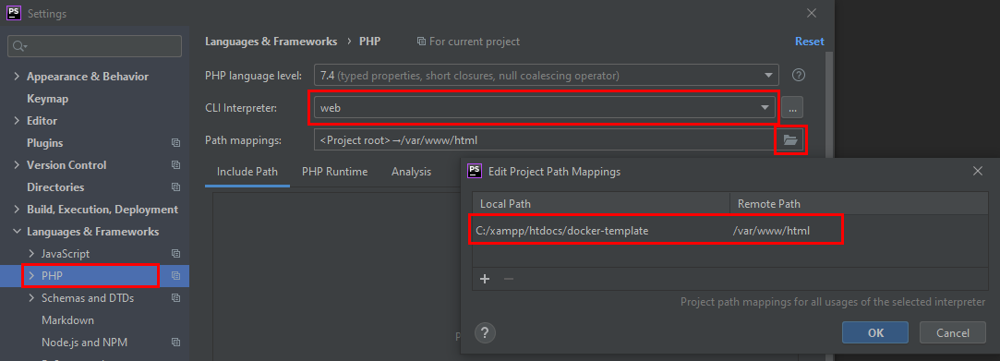

Now you can start debugging your PHP script with...
1. Setting a breakpoint in your PHP script:

   
2. Start running the script with the debug button:

   


#### Xdebug remote connection to server:
To debug an application from a remote server in your local IDE do the following (on the example of project `bti-brandschutz-dev` available at https://dev.bti-brandschutz.de):
> **Warning**: this is currently untested for server xdebug versions `>= 3.X`. You may need to adjust some more xdebug variables. In this case, this may help: https://xdebug.org/docs/upgrade_guide 
1. Make sure your docker container are running
2. Enable xdebug extension on the server. Here with example from Hetzner:
   
   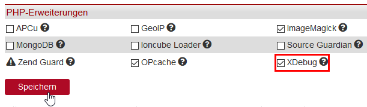
3. Make sure the xdebug variables are set as follows:
   ```ini
   xdebug.remote_enable=1
   xdebug.remote_connect_back=0
   xdebug.remote_host=localhost
   xdebug.remote_port=9000        # change to port 9003 on xdebug version >= 3.X (run 'php --version' to find out)
   ```
   These variables can also be set with an `.htaccess` file in the root directory on the server like:
   ```apacheconf
   php_flag xdebug.remote_enable On
   php_flag xdebug.remote_connect_back Off
   php_value xdebug.remote_host localhost
   php_value xdebug.remote_port 9000       # change to port 9003 on xdebug version >= 3.X (run 'php --version' to find out)
   ```
       
4. Start an SSH tunnel from your machine to the server and enter the ssh password:
   ```shell
   ssh -p <server-ssh-port> -R 9000:<DOMAIN>:9000 <server-ssh-user>@<server-ip>
   ```
   *Note 1*: `DOMAIN` is the domain you configured in your `.env` file. 
   The other parameters should be available from the provider, where the site is hosted. 
   
   *Note 2*: Set the xdebug `9000` to `9003` if the xdebug version of the server is `>= 3.X`. 
   You can find out which xdebug version the server has by running `php --version` if the xdebug extension is enabled
   

5. Once the SSH tunnel connection is established, **follow the steps from *Xdebug usage* above**.

   **Note**: At *step 5* the root of your project is **NOT** `/var/www/html`. 
   Instead, in the SSH session `cd` to the root path of the project and run `pwd` to get the full absolute path.
   Enter this path at *step 5* as your project root.


### 10. Composer, npm, grunt and other commands
Composer, npm and grunt is pre-installed in the `web` container.

`composer install` and `npm install` is automatically executed at container startup if configured.

If you want to manually execute another command, it is best to execute it **in** the `web` container:
```bash
./shell.cmd # go into container on unix/linux
shell.cmd # go into container on windows

composer <any-composer-command>
npm <any-npm-command>
grunt
<any-other-command>
```


### 11. Catch outgoing mails
In a big application it is likely that there will be emails sent to a user at some point.

To avoid sending emails to users while developing or testing, the `web` container catches all emails sent to port `25`,
`465` or `587` and sends them to a local mail server called *MailHog*.

The `web` container will catch these outgoing emails, if you enable it in your `.env` file:
```dotenv
CATCH_MAIL=true
```
To disable catching these emails and sending them normally, just comment out or set to `false`.

You can look at the catched emails at `http://<DOMAIN>:<CATCH_MAIL_PORT>`. The default `CATCH_MAIL_PORT` is `8025`.


# Dockerize the application:


### Note 1:
If you make any changes to one of the following files:
- any `Dockerfile`

make sure to rebuild it:
```shell
docker-compose build
```
After that you can start it again with:
```shell
docker-compose up
```

## Configuration:

### 1. PHP setup
To specify the **PHP version** change the `FROM` command in `./_docker/web/Dockerfile`

e.g. for PHP version 5.6:
```dockerfile
ARG PHP_VERSION=5.6
FROM php:${PHP_VERSION}-apache
```
After that make sure to build this container again (see Note 1 above)

#### PHP Extensions:
To install and enable **PHP extensions** add them to `./_docker/web/Dockerfile`.
```dockerfile
RUN install-php-extensions <extensionname>
```
If this did not work try this:
```dockerfile
RUN docker-php-ext-install <extensionname>
```
All available extensions see here: https://github.com/mlocati/docker-php-extension-installer#supported-php-extensions

More information on https://hub.docker.com/_/php/ at *How to install more PHP extensions*

#### Config:
To edit any `php.ini` config, just add another `.ini` file to `_docker/web/additional-inis/`


### 2. Webserver Setup
If you need to set the root directory of your web application other than `./` 
(for example `/webroot`) set it in `_docker/web/sites-available/000-default.conf`:
```apacheconf
# ...
DocumentRoot /var/www/html/webroot
```

### 3. Database configuration
If you need to configure some database parameters (for example `innodb_file_format`), you can do that in the `_docker/db/my.cnf` file.


### 4. Custom application configuration files
If you have a git ignored file (for example a `database_config.php`) in your application that normally needs to be edited,
you can define a template file, that reduces further configuration of the Docker user.

At container startup all environment variable occurrences within this file will be set to the corresponding value and
copied to the defined location.

To do this, first set a file mapping in your `docker-compose.yml` as an environment variable with the prefix `TEMPLATE_`:
```yaml
services:
  web:
    environment:
      TEMPLATE_DB_CONFIG: "database_config.php:./path/to/application/database_config.php"
```
In `_docker/web/templates/` define your configuration template file like this (in this case `database_config.php`):
```php
<?php
return [
    "database" => [
        "host" => '${DOMAIN}',
        "user" => '${DATABASE_USER_MAIN}',
        "password" => '${DATABASE_PASS_MAIN}',
        "database_name" => '${DATABASE_NAME_MAIN}'
    ],
    'wkhtmltopdfBinary' => '${WKHTMLTOPDF_BINARY}'
];
```
This also supports the bash default syntax with `:-` between variable name and default value:
```bash
${DOMAIN:-test.local}
```
If the environment variable `DOMAIN` is not set, this will default to `test.local`

The variables `DATABASE_USER_MAIN` and `DATABASE_PASS_MAIN` should be set in the `_docker/public.env`.
If you have more databases set these variables with a different suffix than `_MAIN`:
```dotenv
DATABASE_USER_MAIN="some_user"
DATABASE_PASS_MAIN="s3cr3tP4ssw0rd"
DATABASE_USER_SOMEOTHERSUFFIX="another_user"
DATABASE_PASS_SOMEOTHERSUFFIX="sauce"
```

In this case the literal environment variables in the file `_docker/web/templates/database_config.php` will be replaced 
with the corresponding environment value and then the file will be copied to `./path/to/application/database_config.php`.

The resulting file `./path/to/application/database_config.php` can be for example:
```php
<?php
return [
    "database" => [
        "host" => 'test.local',
        "user" => 'some_user',
        "password" => 's3cr3tP4ssw0rd',
        "database_name" => 'some_db_name' 
    ],
    "wkhtmltopdfBinary" => '/usr/bin/wkhtmltopdf'
];
```

### 5. Install Composer
Composer is installed in its latest version if you define it as a build argument in the `docker-compose.yml`:
```yaml
services:
  web:
    build:
      args:
        INSTALL_COMPOSER: "true"
```

It runs `composer install` at startup if you set the path where it is executed with the following environment variable in your `docker-compose.yml`:
```yaml
services:
  web:
    # ...
    environment:
      COMPOSER_INSTALL_PATHS: ./
```
If you need to execute `composer install` in multiple paths you can do this by separating them by a `:`:
```yaml
COMPOSER_INSTALL_PATHS: ./path:./another/path
```

If you need another composer version installed (for example `1.x`) you can change this in the `Dockerfile` under `_docker/web/`:
```dockerfile
# install composer
RUN install-php-extensions @composer-1 && apt-get update && apt-get install -y unzip git
```
More info on this on https://github.com/mlocati/docker-php-extension-installer#installing-composer

### 6. Run `npm install` at startup
Node.js and `npm` is installed if you define it as a build argument in the `docker-compose.yml`:
```yaml
services:
  web:
    build:
      args:
        INSTALL_NPM: "true"
```
The same goes for the installation of `grunt` with the build argument `INSTALL_GRUNT`.

If installed it automatically runs `npm install` in the directory you specified with:  
```yaml
services:
  web:
    # ...
    environment:
      NPM_INSTALL_PATHS: ./path/to/sub/dir
```
If you need to execute `npm install` in multiple paths you can do this by separating them by a `:`:
```yaml
NPM_INSTALL_PATHS: ./path:./another/path
```

### 7. Access other applications from the container
If you need to access other applications from the outside that run inside the container, you need make the port available on the outside.

For example, if you run a Vue.js application with `npm run serve` and this application runs *inside* the container on `http://localhost:8080`,
you can make this available on the outside under `http://<DOMAIN>:8080` if you add this to your `docker-compose.yml`:
```yaml
services:
  web:
    ports:
      - "${EXTERNAL_IP:-127.255.255.254}:8080:8080"
```

### 8. Install wkhtmltopdf
If you want to install [wkhtmltopdf](https://wkhtmltopdf.org) as a depencency change the `docker-compose.yml` to:
```yaml
services:
  web:
    build:
      args:
        INSTALL_WKHTMLTOPDF: "true"
```
After that you have to rebuild the container (see Note 1)

The binary path is stored in the environment variable `WKHTMLTOPDF_BINARY` available in the `web` container

### 9. Locales
If you have to install one or more locales in the `web` container, so for example the following PHP function will work... :
```php
setlocale(LC_ALL, 'de_DE.UTF-8');
``` 
... you can add it to the `web` service as a build argument in the `docker-compose.yml`:
```yaml
services:
   web:
      build:
         args:
            INSTALL_LOCALES: "de_DE, fr_FR"
```
`INSTALL_LOCALES` takes a string separated with `,` for multiple locales as input.

### 10. Git submodules
If your application has any git submodules (sub repositories) you can automatically update/pull them at startup with changing your `docker-compose.yml` to:
```yaml
services:
   web:
      environment:
         CONTAINS_GIT_SUBMODULES: "true"
```
This will execute `git submodule update --init --recursive`.

This is also executed automatically if you have a `.gitmodules` file in your root directory. 

To disable, set `CONTAINS_GIT_SUBMODULES` to `"false"`

### 11. Automatically clone remote into sub directory
If you want to automatically add extra needed files, that you normally would copy manually from the live server
and that are available in a public git repository, you can specify the environment variable `CLONE_INTO_<SUFFIX>`
in the `docker-compose.yml`:
```yaml
services:
  web:
    environment:
       CLONE_INTO_SAMPLE: "./sub-directory:github.com/sample/sample.git"  # Warning: git repo link needs to be without 'http://'
```
When starting the container this will clone the public repository `github.com/sample/sample.git` in the background 
and copy it's content to `./sub-directory` **without** the hidden `.git` folder.

### 12. Match your server setup
With Docker you want to match the environment of the server where the application will run later as close as possible.
This helps prevent weird errors and bugs that only occur on the live system or only on your development system.

Here are some additional tips to prevent these discrepancies in the first place:
1. Put as many files as possible into git where it makes sense. This way other developers do not have to copy single files from the live system
   1. put `composer.lock` into git, so other developers have the exact same versions when they install dependencies with `composer install`.
   2. put `.htaccess` to git if possible, so for example redirects are treated the same as on the live system.
   3. use the template files as explained above to automatically configure database configuration files that should not be in git.
2. Replicate the `php.ini` configuration from the server as close as possible. You can configure your own `.ini` file in `_docker/web/additional-inis`.
3. Install the same PHP version as used on the live system with the `FROM` command in the `_docker/web/Dockerfile`
4. Install the same Composer version as used on the live system. 
   This can prevent dependency installation problems. 
   More information on how to install a specific composer version in the `_docker/web/Dockerfile` on here https://github.com/mlocati/docker-php-extension-installer#installing-composer
5. Install all PHP extensions that are required by the application. This is also done in the `_docker/web/Dockerfile`


## Troubleshoot
#### bash into container:
To go into a container simply run the `shell` script with it's two optional parameters.

- The *first parameter* is the corresponding docker service name of the container (for example `db`). The default is `web`.

- The *second parameter* is the shell entry point (for example `/bin/sh`). The default is `/bin/bash`.

```shell
# on unix/linux:
./shell.cmd               # goes into web container
# on windows:
shell.cmd                 # goes into web container

# on unix/linux:
./shell.cmd db            # goes into db container
# on windows:
shell.cmd db              # goes into db container

# on unix/linux:
./shell.cmd db /bin/sh    # goes into db container on /bin/sh
# on windows:
shell.cmd db /bin/sh      # goes into db container on /bin/sh
```


# Roadmap
* [x] initial composer install execution within docker container
* [x] use of docker alpine packages to create smaller container
* [x] set webroot of web application
* [x] move wkhtmltopdf and composer to another dependency, and not .env bc it is git dependent
* [x] Split Documentation in "Dockerize your application", "Run your application in Docker"
* [x] support for multiple sql files imported into seperate databases
* [x] add my.cnf for easier configuration
* [x] performance improvements (switch to hyper-v)
* [x] echo of localhost:<port> after starting container
* [x] further installation logic (composer install, npm install, etc...)
* [x] some method to run several projects at the same time without port collision and easy access to web and database
* [x] automatic adding of host resolution to hosts file with startup script
* [x] make npm and composer available in main container
* [x] fix startup.sh output when DOMAIN is undefined
* [x] support for multiple npm/composer install directories
* [x] easier mariadb connection setup
* [x] access from another device in the network
* [x] setup for https connections (sgv project?)
* [x] fix database connection
* [x] fix hosts file script
* [x] add output `started at http://192.15.34.5 + https?` to `startup.sh`
* [x] get rid of apache2-foreground ssl:warnings
* [x] automate config files more - "template"-language, that dynamically replaces ${VARIABLES} of config files and maps them with volumes
* [x] install grunt into container
* [x] error when database name has - in name
* [x] 3307 as default port
* [x] replace-templates.sh: support for default values (syntax: `${WEB_PORT:-80}`)
* [x] bti-brandschutz: Fehler beim Anmelden: funktioniert nicht für bti-brandschutz.docker domain (Problem nur im Chrome: gefixt mit Cookies UND Websitedaten löschen: chrome://settings/siteData?searchSubpage=.docker)
* [x] test WKHTMLTOPDF in application
* [x] automate LOOPBACK_IP?
* [x] xdebug path mapping documentation
* [x] support xdebug with remote server (ssh tunnel etc.)
* [x] reroute emails to mailhog installation
* [x] INSTALL_NPM flag + INSTALL_GRUNT flag for Dockerfile
* [x] script for automatic web container entrance? -> docker-compose exec web bash
* [x] container entrance script independent of platform?
* [x] support for php script xdebugging (e.g. via cake command class or classic script) -> PHPStorm: Languages & Frameworks - PHP -> CLI Interpreters; PHPStorm: Build, Execution, Deployment - Docker - add new Docker connection with path mapping
* [x] progress output for initial .sql file import (working inside container; not working with `docker-compose up`)
* [x] php xdebug script with docker
* [x] rename image + containers: <name>-web, <name>-db
* [x] xdebug PHP script testing with xdebug < 3.X
* [x] hint in documentation that `docker-compose down` will delete database in container (all changes gone)
* [x] Dockerization Tips: put files to git, where it makes sense; add php.ini as configured on live server, correct PHP version as on server, composer.lock used on server, to install exactly those versions, correct composer version, install all required php extensions
* [x] automate `git submodule update --init --recursive`
* [x] MERGE_DIR script for IFAA magento 1
* [x] npm and composer install in it's own script, not in startup.sh
* [x] install-locales and install-xdebug in Dockerfile (https://github.com/mlocati/docker-php-extension-installer#installing-specific-versions-of-an-extension) -> better caching
* [x] make npm run serve output available outside of container (bti-brandschutz) -> npm port is not always the same
* [x] clone-into.sh documentation
* [x] create valid certificate instead of self signed -> mkcert script? -> for testing of service worker (bti-brandschutz)
* [x] firefox windows documentation for valid certificates
* [x] switch to default tld `.local` instead of `.docker`
* [x] when starting multiple docker container, there is a problem with port allocation with EXTERNAL_IP
* [ ] test xdebug AND install-cert.cmd on linux (Marius or Timo) and on macOS (Johannes? Jana? Anna-Lisa?)
* [ ] try https://github.com/drud/ddev with ifaa? 
* [ ] dockerize IFAA (Genesis World, ERP, Shop) (-> clone-into.sh: support for ftp and git with authentication)
* [ ] updaten: gkm-auftragsverwaltung, bti-brandschutz
